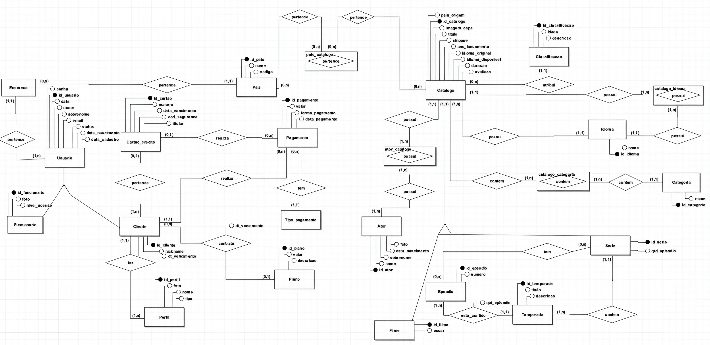
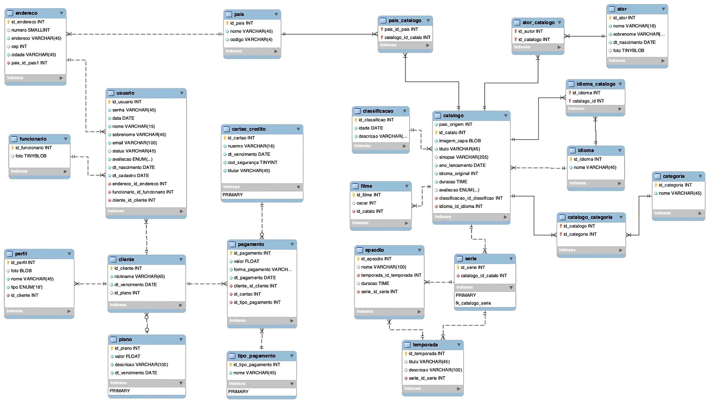

# Estrutura de Armazenamento para Ecossistemas de Streaming

Esse é um projeto de banco de dados visando criar uma estrutura de dados para armazenar informações de serviço de conteúdos multimídia. O projeto foi desenvolvido utilizando o sistema de gerenciamento MySQL para garantir a eficácia e confiabilidade na gestão dos dados.

## Modelo Conceitual

## Modelo Logico

## Scripts

|Scripts    |Clique aqui|
|-----------|-----------|
|DDL        |[Clique aqui](/2_Scripts/1_DDL.sql)|
|Dados      |[Clique aqui](/2_Scripts/2_Insert_dados_de_teste.sql)|
|views      |[Clique aqui](/2_Scripts/3_Views.sql)|
|Procedures_insert|[Clique aqui](/2_Scripts/4_Procedure_INSERT.sql)|
|procedures_update|[Clique aqui](/2_Scripts/5_Procedure_UPDATE.sql)|
|procedures_delete|[Clique aqui](/2_Scripts/6_Procedure_DELETE.sql)|
|Dumps      |[Clique aqui](/3_Dumps/)|

## Tabelas

- Tabela `país`:

    | id_pais | nome   | codigo |
    |---------|--------|--------|
    | 1       | Brasil | BR     |
    | 2       | EUA    | US     |
    | ...     | ...    | ...    |

- Tabela `classificacao`:

    | id_classificacao | idade | descricao |
    |------------------|-------|-----------|
    | 1                | 18    | Adulto    |
    | 2                | 8     | Infantil  |
    | ...              | ...   | ...       |

- Tabela `ator`:

    | id_ator | nome   | sobrenome | nascimento | foto |
    |---------|--------|-----------|------------|------|
    | 1       | João   | Silva     | 1980-01-01 | ...  |
    | 2       | Maria  | Santos    | 1995-05-10 | ...  |
    | ...     | ...    | ...       | ...        | ...  |

- Tabela `idioma`:

    | id_idioma | nome      |
    |-----------|-----------|
    | 1         | Português |
    | 2         | Inglês    |
    | ...       | ...       |

- Tabela `categoria`:

    | id_categoria | nome      |
    |--------------|-----------|
    | 1            | Ação      |
    | 2            | Comédia   |
    | ...          | ...       |

- Tabela `catalogo`:

    | id_catalogo | titulo     | sinopse | ano_lancamento | duracao | avaliacao | idioma_original | id_classificacao |
    |-------------|------------|---------|----------------|---------|-----------|-----------------|------------------|
    | 1           | Filme A    | ...     | 2022           | 02:30   | 4         | 1               | 1                |
    | 2           | Série B    | ...     | 2021           | 00:45   | 3         | 2               | 2                |
    | ...         | ...        | ...     | ...            | ...     | ...       | ...             | ...              |

- Tabela `pais_catalogo`:

    | id_pais | id_catalogo |
    |---------|-------------|
    | 1       | 1           |
    | 1       | 2           |
    | ...     | ...         |

- Tabela `idioma_catalogo`:

    | id_idioma | id_catalogo |
    |-----------|-------------|
    | 1         | 1           |
    | 2         | 2           |
    | ...       | ...         |

- Tabela `ator_catalogo`:

    | id_ator | id_catalogo |
    |---------|-------------|
    | 1       | 1           |
    | 2       | 1           |
    | ...     | ...         |

- Tabela `categoria_catalogo`:

    | id_categoria | id_catalogo |
    |--------------|-------------|
    | 1            | 1           |
    | 2            | 1           |
    | ...          | ...         |

- Tabela `filme`:

    | id_filme | osca | id_catalogo |
    |----------|------|-------------|
    | 1        | null | 1           |
    | 2        | null | 2           |
    | ...

- Tabela `serie`:

    | id_serie | id_catalogo |
    |----------|-------------|
    | 1        | 2           |
    | 2        | 3           |
    | ...      | ...         |

- Tabela `temporada`:

    | id_temporada | titulo | descricao | id_serie |
    |--------------|--------|-----------|----------|
    | 1            | Temporada 1 | ... | 1        |
    | 2            | Temporada 2 | ... | 1        |
    | ...          | ...    | ...       | ...      |

- Tabela `episodio`:

    | id_episodio | nome | duracao | id_temporada | id_serie |
    |-------------|------|---------|--------------|----------|
    | 1           | Episódio 1 | 00:30 | 1            | 1        |
    | 2           | Episódio 2 | 00:30 | 1            | 1        |
    | ...         | ...  | ...     | ...          | ...      |

- Tabela `endereco`:

    | id_endereco | numero | endereco | cep      | cidade  | id_pais |
    |-------------|--------|----------|----------|---------|---------|
    | 1           | 123    | Rua A    | 12345678 | CidadeA | 1       |
    | 2           | 456    | Rua B    | 87654321 | CidadeB | 2       |
    | ...         | ...    | ...      | ...      | ...     | ...     |

- Tabela `pessoa`:

    | id_pessoa | nome  | sobrenome | senha | email                 | status | avaliacao | dt_nascimento | dt_cadastro | id_endereco |
    |-----------|-------|-----------|-------|-----------------------|--------|-----------|---------------|-------------|-------------|
    | 1         | João  | Silva     | ...   | joao.silva@example.com | ...    | 4         | 1980-01-01    | ...         | 1           |
    | 2         | Maria | Santos    | ...   | maria.santos@example.com | ...  | 3         | 1995-05-10    | ...         | 2           |
    | ...       | ...   | ...       | ...   | ...                   | ...    | ...       | ...           | ...         | ...         |

- Tabela `funcionario`:

    | id_funcionario | foto | id_pessoa |
    |----------------|------|-----------|
    | 1              | ...  | 1         |
    | 2              | ...  | 2         |
    | ...            | ...  | ...       |

- Tabela `plano`:

    | id_plano | valor | descricao |
    |----------|-------|-----------|
    | 1        | 9.99  | Bronze    |
    | 2        | 14.99 | Prata     |
    | ...      | ...   | ...       |

- Tabela `cartao_credito`:

    | id_cartao | numero         | dt_vencimento | cod_seguranca | titulo |
    |-----------|----------------|---------------|---------------|--------|
    | 1         | 1111222233334444 | 2025-01-01    | 123           | Mastercard |
    | 2         | 5555666677778888 | 2024-03-01    | 456           | Visa       |
    | ...       | ...            | ...           | ...           | ...    |

- Tabela `tipo_pagamento`:

    | id_tipo_pagamento | nome          |
    |-------------------|---------------|
    | 1                 | Cartão de Crédito |
    | 2                 | Transferência Bancária |
    | ...               | ...           |

- Tabela `cliente`:

    | id_cliente | nickname | dt_vencimento | id_plano | id_pessoa |
    |------------|----------|---------------|----------|-----------|
    | 1          | user1    | 2023-01-01    | 1        | 1         |
    | 2          | user2    | 2024-02-01    | 2        | 2         |
    | ...        | ...      | ...           | ...      | ...       |

- Tabela `pagamento`:

    | id_pagamento | valor | dt_pagamento | forma_pagamento | id_cliente | id_cartao | id_tipo_pagamento |
    |--------------|-------|--------------|-----------------|------------|-----------|------------------|
    | 1            | 9.99  | 2022-01-01   | Cartão de Crédito | 1          | 1         | 1                |
    | 2            | 14.99 | 2023-02-01   | Cartão de Crédito | 2          | 2         | 1                |
    | ...          | ...   | ...          | ...             | ...        | ...       | ...              |

- Tabela `perfil`:

    | id_perfil | foto | nome | tipo            | id_cliente |
    |-----------|------|------|-----------------|------------|
    | 1         | ...  | John | perfil adulto   | 1          |
    | 2         | ...  | Jane | perfil infantil | 2          |
    | ...       | ...  | ...  | ...             | ...        |

## Views

- **vw_usuario:** 
 Apresenta informações sobre os usuários do sistema, incluindo funcionários e clientes. Inclui dados como nome, tipo de usuário, data de nascimento, endereço e detalhes do plano.

- **vw_catalogo:** Exibe detalhes sobre os itens do catálogo, identificando se são filmes ou séries. Inclui informações como título, sinopse, ano de lançamento, duração e idiomas disponíveis.

- **vw_episodio:** Mostra os episódios das séries, juntamente com sua duração, título da temporada e título da série correspondente.

- **vw_temporada:** Apresenta informações sobre as temporadas das séries, incluindo título, descrição e quantidade de episódios. Também exibe o título da série associada.

- **vw_ator:** Exibe os atores envolvidos nos catálogos, juntamente com a quantidade de filmes e séries em que atuaram.

- **vw_pagamento:** Mostra os dados dos pagamentos realizados pelos clientes, incluindo nome do cliente, status do pagamento, descrição do plano, valor, tipo de pagamento e data de pagamento.

- **vw_perfil:** Apresenta informações sobre os perfis dos clientes, incluindo o número total de perfis e os tipos de perfil associados a cada cliente.

## Procedures

- **sp_insert_classificacao:** Esta procedure realiza a inserção de uma nova classificação no banco de dados. Ela recebe como parâmetros as informações necessárias para criar uma nova classificação, como nome, descrição, faixa etária, etc.

- **sp_insert_ator:** Esta procedure realiza a inserção de um novo ator no banco de dados. Ela recebe como parâmetros os dados do ator, como nome, data de nascimento, nacionalidade, etc., e cria um novo registro para o ator.

- **sp_insert_idioma:** Esta procedure realiza a inserção de um novo idioma no banco de dados. Ela recebe como parâmetros as informações do idioma, como nome e código, e insere um novo registro na tabela de idiomas.

- **sp_insert_categoria:** Esta procedure realiza a inserção de uma nova categoria no banco de dados. Ela recebe como parâmetros os dados da categoria, como nome e descrição, e cria um novo registro na tabela de categorias.

- **sp_insert_catalogo:** Esta procedure realiza a inserção de um novo catálogo no banco de dados. Ela recebe como parâmetros as informações do catálogo, como título, descrição, data de lançamento, etc., e insere um novo registro na tabela de catálogos.

- **sp_insert_pais_catalogo:** Esta procedure realiza a associação entre um país e um catálogo no banco de dados. Ela recebe como parâmetros o ID do país e o ID do catálogo e cria um novo registro na tabela de associação país-catálogo.

- **sp_insert_idioma_catalogo:** Esta procedure realiza a associação entre um idioma e um catálogo no banco de dados. Ela recebe como parâmetros o ID do idioma e o ID do catálogo e insere um novo registro na tabela de associação idioma-catálogo.

- **sp_insert_ator_catalogo:** Esta procedure realiza a associação entre um ator e um catálogo no banco de dados. Ela recebe como parâmetros o ID do ator e o ID do catálogo e cria um novo registro na tabela de associação ator-catálogo.

- **sp_insert_categoria_catalogo:** Esta procedure realiza a associação entre uma categoria e um catálogo no banco de dados. Ela recebe como parâmetros o ID da categoria e o ID do catálogo e insere um novo registro na tabela de associação categoria-catálogo.

- **sp_insert_filme:** Esta procedure realiza a inserção de um novo filme no banco de dados. Ela recebe como parâmetros as informações do filme, como título, duração, diretor, etc., e cria um novo registro na tabela de filmes.

- **sp_insert_serie:** Esta procedure realiza a inserção de uma nova série no banco de dados. Ela recebe como parâmetros os dados da série, como título, data de lançamento, descrição, etc., e insere um novo registro na tabela de séries.

- **sp_insert_temporada:** Esta procedure realiza a inserção de uma nova temporada no banco de dados. Ela recebe como parâmetros as informações da temporada, como número, título, data de lançamento, etc., e cria um novo registro na tabela de temporadas.

- **sp_insert_episodio:** Esta procedure realiza a inserção de um novo episódio no banco de dados. Ela recebe como parâmetros os dados do episódio, como número, título, duração, etc., e insere um novo registro na tabela de episódios.

- **sp_insert_endereco:** Esta procedure realiza a inserção de um novo endereço no banco de dados. Ela recebe como parâmetros as informações do endereço, como rua, número, cidade, etc., e cria um novo registro na tabela de endereços.

- **sp_insert_pessoa:** Esta procedure realiza a inserção de uma nova pessoa no banco de dados. Ela recebe como parâmetros os dados da pessoa, como nome, data de nascimento, gênero, etc., e insere um novo registro na tabela de pessoas.

- **sp_insert_funcionario:** Esta procedure realiza a inserção de um novo funcionário no banco de dados. Ela recebe como parâmetros as informações do funcionário, como nome, cargo, salário, etc., e cria um novo registro na tabela de funcionários.

- **sp_insert_plano:** Esta procedure realiza a inserção de um novo plano no banco de dados. Ela recebe como parâmetros os dados do plano, como nome, descrição, valor, etc., e insere um novo registro na tabela de planos.

- **sp_insert_cartao_credito:** Esta procedure realiza a inserção de um novo cartão de crédito no banco de dados. Ela recebe como parâmetros os dados do cartão, como número, titular, validade, etc., e cria um novo registro na tabela de cartões de crédito.

- **sp_insert_tipo_pagamento:** Esta procedure realiza a inserção de um novo tipo de pagamento no banco de dados. Ela recebe como parâmetros as informações do tipo de pagamento, como nome, descrição, etc., e insere um novo registro na tabela de tipos de pagamento.

- **sp_insert_cliente:** Esta procedure realiza a inserção de um novo cliente no banco de dados. Ela recebe como parâmetros os dados do cliente, como nome, e-mail, telefone, etc., e cria um novo registro na tabela de clientes.

- **sp_insert_pagamento:** Esta procedure realiza a inserção de um novo pagamento no banco de dados. Ela recebe como parâmetros as informações do pagamento, como valor, data, tipo de pagamento, etc., e insere um novo registro na tabela de pagamentos.

- **sp_insert_perfil:** Esta procedure realiza a inserção de um novo perfil no banco de dados. Ela recebe como parâmetros os dados do perfil, como nome, descrição, etc., e cria um novo registro na tabela de perfis.

Cada uma das procedures acima é responsável pela operação de inserção de um determinado elemento no banco de dados, facilitando a criação de registros e a associação de dados, ha tambem procedures de UPDATE e DELETE.

## Contatos

|  |  
|-----------|-----------|

